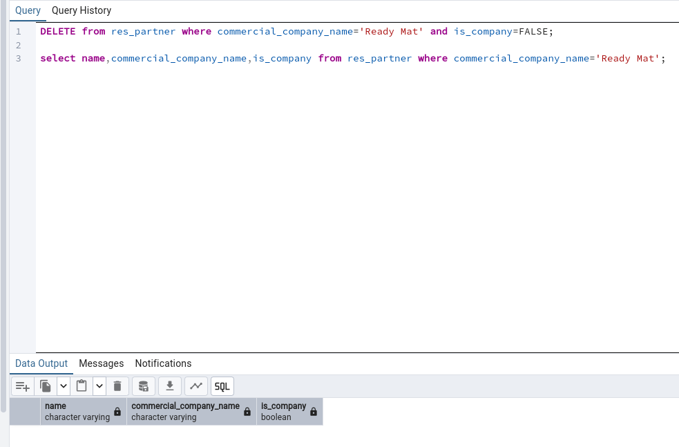

# Tarea12SXE

Apartado 1:

```
Create table EmpresasFCT (
	idEmpresa serial
	nombre varchar(40),
	quiereAlumnos boolean
	numAlumnos integer,
	fechaContacto date,
	Primary key (idEmpresa)
);
```
Apartado 2:

```
insert into EmpresasFCT values (1,'ejemplo',true,1,'2000-05-10');
insert into EmpresasFCT values (2,'ejemplo',true,1,'2000-05-10');
insert into EmpresasFCT values (3,'ejemplo',true,1,'2000-05-10');
insert into EmpresasFCT values (4,'ejemplo',true,1,'2000-05-10');
insert into EmpresasFCT values (5,'ejemplo',true,1,'2000-05-10');
```

Apartado 3:

```
SELECT * FROM EmpresasFCT order by fechaContacto;
```

Apartado 4:

```
SELECT name,city,commercial_company_name from res_partner where city = 'Tracy' and is_company = false order by commercial_company_name;
```

Apartado 5:

```
SELECT r.name,
       a.name,
       a.invoice_date,
       a.amount_untaxed_signed
from res_partner r
left join account_move a
on a.partner_id=r.id
       where a.move_type='in_refund'
       order by a.invoice_date desc;
```

Apartado 6:

```
SELECT r.name,
       count(distinct a.name) as num_facturas,
       sum(distinct a.amount_untaxed_signed) as total_sin_impuestos
from res_partner r 
join account_move a
on a.partner_id=r.id 
       where a.move_type='out_invoice' 
       and state='posted'
       group by r.name
       having count(*) > 2
```

Apartado 7:

```
UPDATE res_partner set email = replace(email, '@bilbao.example.com', '@bilbao.bizkaia.neus');
```

Apartado 8:

```
DELETE from res_partner where commercial_company_name='Ready Mat' and is_company=FALSE;
```
 
